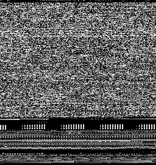

# binarypic

Small program to convert a binary file to grayscale 1-byte-1-pixel `png` using
[stb_image_write](https://github.com/nothings/stb).

The idea for this program appeared when I ran across a multi-meg file that had
most of its bytes set to 0 but due to its size even tiny font and a fullscreen
hex viewer weren't enough to show it. An image generated by this program would
make such large swathes of 0s or other patterns easy to see at a glance.

Example of image generated from exe of this very program:

Go to releases to download a Windows exe compiled with Pelles C with no `-O2`
to avoid running into any `-O2` optimizer bug similar to this one that affected
`stb_image`: [Pelles C forum bug report](https://forum.pellesc.de/index.php?topic=7837.0)
